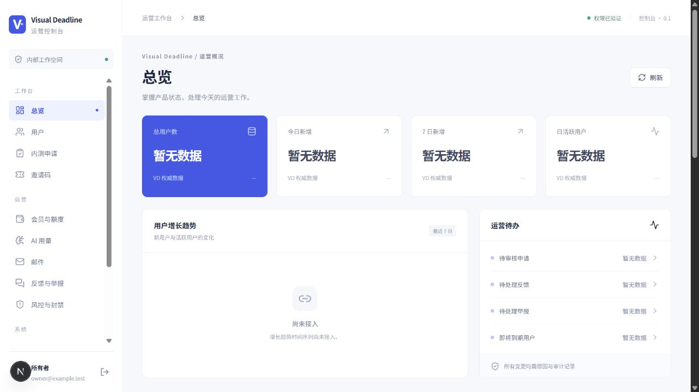
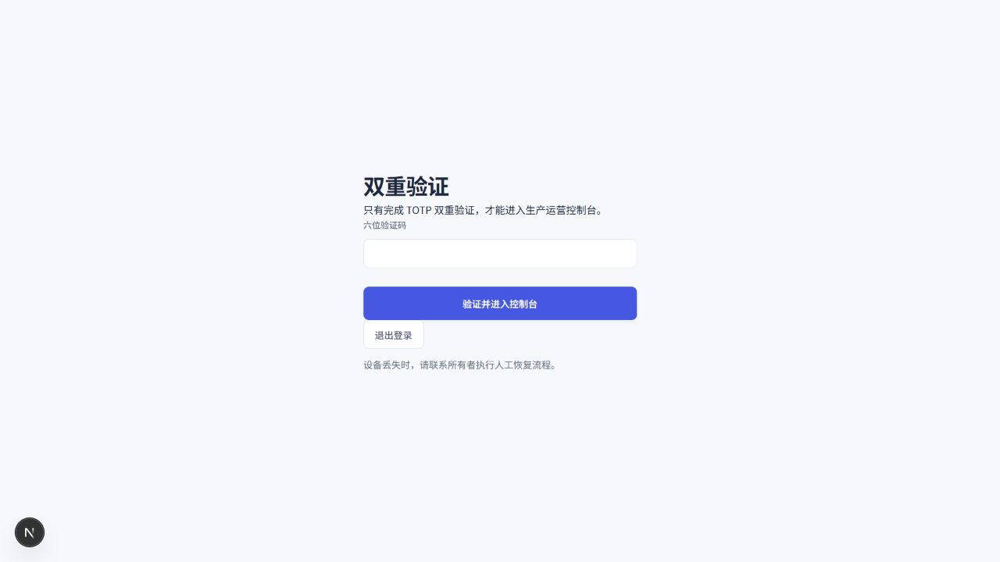

# Admin-1 本地验收记录

日期：2026-09-28。环境：Windows、Node.js 25.2.1、npm 11.6.2、Next.js 16.3.6。依赖锁定在 package-lock.json；CI 使用 Node.js 22。

| 检查                    | 已观察结果                                                                                                                  |
| ----------------------- | --------------------------------------------------------------------------------------------------------------------------- |
| npm test                | 34 / 34 通过                                                                                                                |
| npm run typecheck       | 通过，先生成 Next route types                                                                                               |
| npm run build           | 通过，受保护页面与登录为动态服务端页面                                                                                      |
| npm run check:client    | 17 个构建资源通过特权标识与 fixture token 检查                                                                              |
| npm run test:http       | 59 项真实 Route Handler 合约检查通过                                                                                        |
| npm run test:production | nonce / CSP / 缓存 / frame 防护及生产 MFA 注册、挑战、AAL1 页面和 API 拒绝、AAL2 放行、旧 AAL1 拒绝、注销与 Cookie 属性通过 |
| 本次浏览器              | 密码登录、TOTP 注册、错误验证码、AAL2 后控制台、再次登录挑战、注销后 MFA 拒绝、Pro 按钮禁用通过                             |
| 既有验收                | 原有 768 px 布局与邮件预览记录保留；本次聚焦认证与套餐边界                                                                  |
| 浏览器控制台            | 验证时未观察到 error / warn                                                                                                 |

HTTP 与浏览器验证只使用本地 contract fixture。这里的账号、申请、邀请和回执全部为合成测试数据；截图中不展示真实运营指标。没有查询生产数据库、发送邮件、访问受限真实用户内容或修改产品业务数据。

## 界面截图

本地合约测试视图，非生产连接。数字指标保持未知，不插入模拟增长趋势。

## 验证边界

这些检查证明 Admin 的权限、路由、渲染、安全边界与命令 / 回执处理。它们不证明 VD 的真实数据库事务、邀请码规则、会员计算、额度重置、封禁执行、审计不可变性或服务商投递已经实现。需要按 VD_ADMIN_CONTRACT.md 在产品后端单独验收。

## 本次基础补强的验证方式

Admin-1 仍是经过合约测试的控制台，未启用生产运营写入。下一项必需依赖是 VD 权威管理 API。Free / Plus / Pro 是目标模型；生产强制 Supabase TOTP MFA / AAL2。

`test:production` 同时运行未配置环境和已配置的本地 Auth double。后者在独立 Node 测试进程预加载 `auth-fixture-preload.mjs`，仅将保留域名 `https://auth.example.test` 请求映射至回环 fixture；生产应用没有测试开关、fixture 导入或 TLS 校验放宽。生产代码实际运行 NODE_ENV=production。API 通过 AAL2 后返回 CONTRACT_PENDING，证明认证放行而真实 VD 写入仍未接入。

fixture 验证固定的合成测试验证码，不生成或验证真实 TOTP；它证明请求顺序、因子归属、会话升级与 UI 行为，不替代真实 Supabase 项目验收。过期 JWT 和错误主体另有单元测试。浏览器使用开发运行时；生产 AAL1 页面 / API 拒绝由生产 HTTP 测试验证。所有原有安全测试保留。

MFA 注册响应为 no-store；SSR HTML、验证响应、客户端产物和运行日志中无密钥 sentinel。源码回归禁止客户端 console、浏览器存储和 SVG DOM 注入。测试截图只保留挑战页，不保存注册二维码或密钥。

## PR140 source-list compatibility

The VD entitlements list returns one entitlement/source record with its own `id`, `userId`, tier/source/status/validity/reason and effective tier. An optional `grantId` identifies only an independent administrator grant; the UI offers revocation only when that authoritative ID exists. Subscription records have no administrator revocation action. User detail remains aggregated and its existing grant controls remain supported.

Ordinary invitation lists contain masked codes. The console labels these as `脱敏码不可复制`; full codes are displayed only in the successful creation or matching original idempotent receipt. No production configuration, deployment or subscription edit is enabled by this compatible change.
